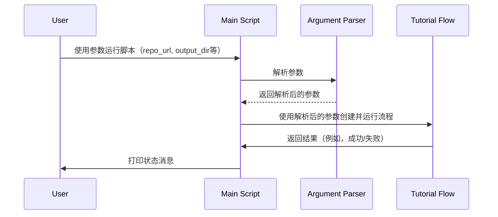

# 第1章：主执行脚本

想象一下您正在导演一部电影。您有演员、剧本、服装和布景。但在您这位导演喊出"开始！"之前，什么都不会发生。我们项目中的`main`执行脚本就像这个导演。它是起点，是启动整个教程生成过程的"开始！"命令。

本章将指导您了解`main`脚本以及它如何协调从GitHub仓库创建教程的过程。

**为什么我们需要一个主执行脚本？**

这样想：我们想从GitHub仓库创建一个教程。我们需要：

1. 知道使用*哪个*仓库。
2. 知道将教程保存在*哪里*。
3. 可能需要自定义*包含或排除*哪些文件。

`main`脚本处理所有这些。它是收集信息并启动教程生成过程的中央枢纽。

**关键概念**

让我们将`main`脚本分解为更简单的部分：

1. **命令行参数：** 这些是您运行程序时提供的指令。把它想象成在餐厅点餐。您告诉服务员（程序）您想要什么（参数）。

2. **配置：** 设置环境。这包括GitHub令牌（如果您有）和有关要包含或排除哪些文件的默认设置。

3. **"流程"：** 这是程序生成教程所采取的步骤序列。它就像烘焙蛋糕的配方。

**使用`main`脚本：一个简单的例子**

假设我们想为GitHub上名为"my-cool-project"的仓库生成一个教程。我们会这样运行程序（在终端中）：

```bash
python main.py https://github.com/your-username/my-cool-project
```

这里，`python main.py`告诉您的计算机运行`main.py`文件。`https://github.com/your-username/my-cool-project`是我们给程序的*参数* - GitHub仓库的URL。

**当您运行此命令时会发生什么？**

1. `main`脚本接收仓库URL。
2. 它检查您是否提供了项目名称。如果没有，它会从URL中推断出来。
3. 它设置"流程" - 创建教程所需的步骤。
4. 它启动教程生成过程！

**来看看一些代码！**

以下是`main`函数的简化版本：

```python
import argparse

def main():
    parser = argparse.ArgumentParser(description="Generate a tutorial for a GitHub codebase.")
    parser.add_argument("repo_url", help="URL of the public GitHub repository.")
    parser.add_argument("-o", "--output", default="output", help="Base directory for output (default: ./output).")

    args = parser.parse_args()

    print(f"Generating tutorial for: {args.repo_url}")
    print(f"Output directory: {args.output}")

if __name__ == "__main__":
    main()
```

**解释：**

* `import argparse`：这行导入了一个帮助我们处理命令行参数的库。把它想象成导入一个用于处理用户输入的工具箱。
* `parser = argparse.ArgumentParser(...)`：这创建了一个参数解析器。它就像设置一个表格来收集用户的信息。
* `parser.add_argument(...)`：这些行向解析器添加特定参数。在这种情况下，我们添加仓库URL（`repo_url`）和输出目录（`output`）。
* `args = parser.parse_args()`：这行获取用户提供的参数并将它们存储在名为`args`的变量中。
* `print(f"Generating tutorial for: {args.repo_url}")`：这行向控制台打印一条消息，告诉您正在为哪个仓库生成教程。
* `if __name__ == "__main__":`：这是Python中说"如果直接执行此文件，则运行`main`函数"的标准方式。

**更多选项！**

`main`脚本还允许您通过更多参数自定义教程生成过程。例如：

* `-n`或`--name`：指定项目名称（而不是从URL派生）。
* `-t`或`--token`：提供GitHub个人访问令牌（对私有仓库或避免速率限制很有用）。
* `-i`或`--include`：指定要包含的文件模式（例如，"*.py"仅包含Python文件）。
* `-e`或`--exclude`：指定要排除的文件模式（例如，"tests/*"排除测试文件）。

**内部原理：它是如何工作的**

以下是`main`脚本内部发生的事情的简化视图：



**序列图解释：**

1. **用户**运行`main`脚本，提供诸如仓库URL等参数。
2. **主脚本**使用**参数解析器**来理解这些参数。
3. **参数解析器**将解析后的参数返回给**主脚本**。
4. **主脚本**使用解析后的参数创建并运行**教程流程**（我们将在下一章了解这一点！）。
5. **教程流程**完成工作并将结果发送回**主脚本**。
6. **主脚本**然后告诉**用户**发生了什么（例如，"教程生成成功！"）。

**深入代码（文件：`main.py`）**

让我们看一下`main.py`中稍微完整一点的代码片段：

```python
import dotenv
import os
import argparse
from flow import create_tutorial_flow

dotenv.load_dotenv()

def main():
    parser = argparse.ArgumentParser(description="Generate a tutorial for a GitHub codebase.")
    parser.add_argument("repo_url", help="URL of the public GitHub repository.")
    # ... （其他参数） ...

    args = parser.parse_args()

    github_token = args.token or os.environ.get('GITHUB_TOKEN')
    if not github_token:
        print("Warning: No GitHub token provided. You might hit rate limits for public repositories.")

    shared = {
        "repo_url": args.repo_url,
        # ... （其他共享数据） ...
    }

    tutorial_flow = create_tutorial_flow()
    tutorial_flow.run(shared)
```

**关键改进：**

* `dotenv.load_dotenv()`：这行从`.env`文件（如果存在）加载环境变量。这是一种方便地存储敏感信息（如GitHub令牌）的方式，无需在脚本中硬编码。
* `github_token = args.token or os.environ.get('GITHUB_TOKEN')`：这行从命令行参数或环境变量中检索GitHub令牌。
* `shared = { ... }`：这创建了一个名为`shared`的字典。这个字典将保存需要在教程生成过程的不同部分之间传递的所有信息。把它想象成一个共享的笔记本，教程的每个工作人员都可以访问。
* `tutorial_flow = create_tutorial_flow()`：这行创建教程生成流程的实例（我们将在[教程生成流程](02_教程生成流程.mdx)中探讨这一点）。
* `tutorial_flow.run(shared)`：这行运行教程生成流程，将`shared`字典作为输入传递进去。

**总结**

`main`执行脚本是我们教程生成交响乐的指挥。它接受您的指令（命令行参数），设置环境，并启动整个过程。它是从GitHub代码库创建精彩教程的关键起点。

现在我们了解了`main`脚本的角色，让我们深入了解教程生成过程的核心：[教程生成流程](02_教程生成流程.mdx)。


---

由[AI Codebase Knowledge Builder](https://github.com/The-Pocket/Tutorial-Codebase-Knowledge)生成 