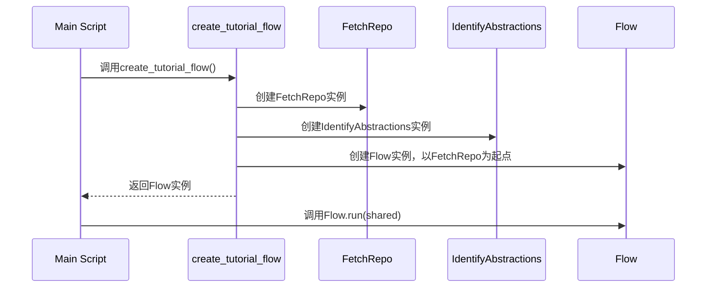

在上一章[主执行脚本](01_main_script.mdx)中，我们了解了`main`脚本如何作为教程生成过程的起点。它就像电影导演，搭建舞台并发出"开始！"的命令。

现在，我们将深入了解"开始！"之后发生的事情 - 创建教程所涉及的实际步骤。这就是**教程生成流程**的用武之地。

**什么是教程生成流程？**

想象一下，您想烤一个蛋糕。您不会随意将原料混在一起，对吧？您会按照食谱进行：

1. 准备原料。
2. 混合湿料和干料。
3. 烘烤蛋糕。
4. 给蛋糕涂上糖霜。

教程生成流程就像从代码库创建教程的食谱。它是按特定顺序执行的一系列步骤，目标是创建一个全面的教程。

`create_tutorial_flow`函数定义了整个过程。把它看作是整个教程创建过程的蓝图。它协调不同的节点（获取仓库、识别抽象等）并按特定顺序连接它们。

**为什么我们需要教程生成流程？**

没有定义好的流程，教程生成过程将会混乱无序。我们需要一个结构化的方法来确保每个步骤按正确的顺序完成，并且最终的教程是连贯且信息丰富的。

**关键概念**

教程生成流程建立在几个关键概念之上：

1. **节点：** 这些是教程生成过程中的单个步骤。每个节点执行特定任务，如获取仓库、识别关键概念或编写章节。我们稍后将详细探讨[节点抽象](06_node_abstraction.mdx)。把节点想象成装配线上的单个工人，每个工人负责过程的特定部分。

2. **流程：** 流程定义了节点执行的顺序。它就像一个流程图，显示数据从一个节点流向下一个节点的路径。我们使用[PocketFlow框架](03_pocket_flow.mdx)来定义和管理流程。

3. **数据共享：** 信息需要在节点之间传递。例如，"获取仓库"节点需要将仓库内容传递给"识别抽象"节点。这是通过共享字典完成的，正如我们在[主执行脚本](01_main_script.mdx)中所看到的。

**一个简单的例子**

假设我们想为一个简单的"Hello World"Python程序创建一个教程。教程生成流程可能看起来像这样：

1. **获取仓库：** 从GitHub下载"Hello World"程序。
2. **识别抽象：** 识别程序中的关键概念（例如，打印到控制台、使用变量）。
3. **编写章节：** 编写解释每个概念的单独章节。
4. **合并教程：** 将章节合并成一个完整的教程。

**使用`create_tutorial_flow`函数**

`create_tutorial_flow`函数负责创建和配置教程生成流程。以下是它在`main.py`脚本中的使用方式（如上一章所见）：

```python
from flow import create_tutorial_flow

# ... （其他代码） ...

tutorial_flow = create_tutorial_flow()
tutorial_flow.run(shared)
```

**解释：**

* `from flow import create_tutorial_flow`：这行从`flow.py`文件导入`create_tutorial_flow`函数。
* `tutorial_flow = create_tutorial_flow()`：这行调用`create_tutorial_flow`函数，该函数创建并返回教程生成流程。返回的流程存储在`tutorial_flow`变量中。
* `tutorial_flow.run(shared)`：这行运行教程生成流程，将`shared`字典作为输入传递。`shared`字典包含流程中的节点需要访问的所有信息，如仓库URL和输出目录。

**内部原理：它是如何工作的**

`create_tutorial_flow`函数执行以下操作：

1. **实例化节点：** 它创建流程中每个节点的实例（例如，`FetchRepo`，`IdentifyAbstractions`）。
2. **连接节点：** 它通过将节点连接在一起来定义节点执行的顺序。这是使用`>>`运算符完成的。
3. **创建流程：** 它创建[PocketFlow框架](03_pocket_flow.mdx)中`Flow`类的一个实例，指定起始节点。

以下是一个简化的序列图来说明这个过程：



**序列图解释：**

1. **主脚本**调用`create_tutorial_flow`函数。
2. `create_tutorial_flow`函数创建**FetchRepo**和**IdentifyAbstractions**节点的实例（还有其他节点，但我们为了简化这个例子）。
3. `create_tutorial_flow`函数创建**Flow**类的实例，指定**FetchRepo**节点为起点。
4. `create_tutorial_flow`函数将**Flow**实例返回给**主脚本**。
5. **主脚本**在**Flow**实例上调用`run`方法，传入`shared`字典。

**深入代码（文件：`flow.py`）**

让我们看看`flow.py`中`create_tutorial_flow`函数的代码：

```python
from pocketflow import Flow
# 从nodes.py导入所有节点类
from nodes import (
    FetchRepo,
    IdentifyAbstractions,
    AnalyzeRelationships,
    OrderChapters,
    WriteChapters,
    CombineTutorial
)

def create_tutorial_flow():
    """创建并返回代码库教程生成流程。"""

    # 实例化节点
    fetch_repo = FetchRepo()
    identify_abstractions = IdentifyAbstractions(max_retries=3, wait=10)
    analyze_relationships = AnalyzeRelationships(max_retries=3, wait=10)
    order_chapters = OrderChapters(max_retries=3, wait=10)
    write_chapters = WriteChapters(max_retries=3, wait=10) # 这是一个BatchNode
    combine_tutorial = CombineTutorial()

    # 根据设计按顺序连接节点
    fetch_repo >> identify_abstractions
    identify_abstractions >> analyze_relationships
    analyze_relationships >> order_chapters
    order_chapters >> write_chapters
    write_chapters >> combine_tutorial

    # 创建从FetchRepo开始的流程
    tutorial_flow = Flow(start=fetch_repo)

    return tutorial_flow
```

**解释：**

* `from pocketflow import Flow`：这行从[PocketFlow框架](03_pocket_flow.mdx)导入`Flow`类。
* `from nodes import (...)`：这行从`nodes.py`文件导入所有节点类。我们将在[节点抽象](06_node_abstraction.mdx)中了解更多。
* `fetch_repo = FetchRepo()`：这行创建`FetchRepo`节点的实例。
* `fetch_repo >> identify_abstractions`：这行将`FetchRepo`节点连接到`IdentifyAbstractions`节点。`>>`运算符意味着`FetchRepo`的输出将作为输入传递给`IdentifyAbstractions`。
* `tutorial_flow = Flow(start=fetch_repo)`：这行创建`Flow`类的实例，指定`FetchRepo`节点为起点。
* `return tutorial_flow`：这行返回创建的流程。

**总结**

`create_tutorial_flow`函数是我们教程生成过程的核心。它定义了从代码库创建教程所遵循的步骤序列。通过理解节点、流程和数据共享的关键概念，您可以自定义教程生成过程以满足您的特定需求。

现在我们了解了教程生成流程，让我们探索使其成为可能的[PocketFlow框架](03_pocket_flow.mdx)。


---

由[AI Codebase Knowledge Builder](https://github.com/The-Pocket/Tutorial-Codebase-Knowledge)生成 