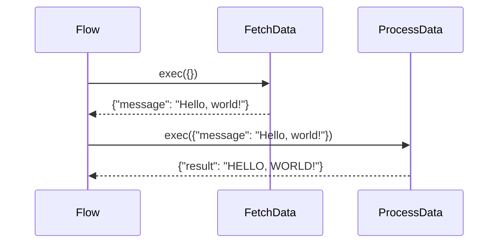

# 第3章：PocketFlow框架

在上一章[教程生成流程](02_教程生成流程.mdx)中，我们了解了教程创建过程是如何被结构化为一系列步骤的。但我们如何*管理*这个序列呢？我们如何确保每个步骤按正确的顺序执行，并且数据在它们之间无缝传递？这就是PocketFlow框架的用武之地！

**什么是PocketFlow？**

PocketFlow是一个轻量级框架，用于构建数据处理管道。把它想象成一条装配线，每个工作站（节点）执行特定任务，将结果传递给下一个工作站。它允许您以结构化和可管理的方式定义一系列操作（如获取数据、分析数据和写入结果）。它提供了一个结构来管理不同组件之间的数据流和执行流程。

想象一下您正在制造一辆汽车。您不会随意安装零部件，对吧？您会有一个系统：

1. 安装底盘。
2. 安装引擎。
3. 添加轮子。
4. 给汽车喷漆。

PocketFlow帮助我们在教程生成过程中做同样的事。它提供了连接这些不同步骤的结构。

**为什么我们需要PocketFlow？**

没有像PocketFlow这样的框架，管理教程生成流程将会困难得多。我们必须手动跟踪执行顺序、处理数据传递和管理错误。PocketFlow简化了所有这些，使我们的代码更有组织、更易读和更易维护。

**关键概念**

PocketFlow围绕两个核心概念展开：

1. **节点：** 这些是管道中的各个步骤，正如我们在[教程生成流程](02_教程生成流程.mdx)中讨论的。每个节点执行特定任务，如从GitHub获取数据或编写教程章节。

2. **流程：** 流程定义了节点执行的顺序。它就像一个食谱，告诉框架在哪个节点之后运行哪个节点。

**一个简单的例子**

让我们考虑一个简化的教程生成流程，包含两个节点：

1. **FetchData：** 从源（例如，GitHub仓库）获取数据。
2. **ProcessData：** 处理获取的数据（例如，分析代码）。

使用PocketFlow，我们可以这样定义这个流程：

```python
from pocketflow import Flow, Node

class FetchData(Node):
    def exec(self, input_data):
        # 模拟获取数据
        data = {"message": "Hello, world!"}
        return data

class ProcessData(Node):
    def exec(self, input_data):
        # 模拟处理数据
        message = input_data["message"]
        processed_message = message.upper()
        return {"result": processed_message}

# 实例化节点
fetch_data = FetchData()
process_data = ProcessData()

# 定义流程
fetch_data >> process_data  # FetchData的输出成为ProcessData的输入

# 创建流程
flow = Flow(start=fetch_data)

# 运行流程
result = flow.run({}) # 从空输入开始
print(result) # 输出: {'result': 'HELLO, WORLD!'}
```

**解释：**

* `from pocketflow import Flow, Node`：这行从`pocketflow`库导入`Flow`和`Node`类。
* `class FetchData(Node):`：这定义了一个名为`FetchData`的节点，继承自`Node`类。
* `def exec(self, input_data):`：这定义了`exec`方法，它是节点的核心。它接受输入数据，执行一些处理，并返回结果。
* `fetch_data >> process_data`：这行通过使用`>>`运算符将`FetchData`节点连接到`ProcessData`节点来定义流程。这意味着`FetchData`的输出将作为输入传递给`ProcessData`。
* `flow = Flow(start=fetch_data)`：这创建了`Flow`类的一个实例，指定`FetchData`节点为起点。
* `result = flow.run({})`：这运行流程，从`FetchData`节点开始，并传入一个空字典作为初始输入。

**内部原理：它是如何工作的**

当您调用`flow.run()`时，PocketFlow执行以下操作：

1. 它从起始节点（在我们的例子中，是`FetchData`）开始。
2. 它调用节点的`exec()`方法，传入输入数据。
3. 它获取`exec()`方法的输出，并将其作为输入传递给流程中的下一个节点（通过`>>`连接）。
4. 它重复步骤2和3，直到流程中的所有节点都已执行完毕。
5. 它返回流程中最后一个节点的输出。

这里是一个简化的序列图：



**深入代码（文件：`pocketflow.py` - 简化版）**

虽然实际的`pocketflow.py`文件可能包含更多特性，但这里有一个简化版本来说明核心概念：

```python
class Node:
    def prep(self, shared):
        """可选的准备步骤。可以修改共享数据。"""
        return None # 默认实现

    def exec(self, prep_res):
        """必须由子类实现。执行节点的任务。"""
        raise NotImplementedError("exec()必须由子类实现")

    def post(self, shared, prep_res, exec_res):
        """可选的后处理步骤。可以修改共享数据。"""
        pass # 默认实现

    def __rshift__(self, other_node):
        """重载 >> 运算符用于在流程中连接节点。"""
        return FlowConnection(self, other_node)

class FlowConnection:
    """表示两个节点之间的连接。"""
    def __init__(self, from_node, to_node):
        self.from_node = from_node
        self.to_node = to_node

class Flow:
    def __init__(self, start):
        self.start = start
        self.nodes = self._build_node_list(start)

    def _build_node_list(self, start_node):
        """构建流程中节点的列表。"""
        nodes = []
        current_node = start_node
        while current_node:
            nodes.append(current_node)
            if hasattr(current_node, '__flow_connection__'):
                current_node = current_node.__flow_connection__.to_node
            else:
                current_node = None
        return nodes

    def run(self, shared):
        """运行流程。"""
        current_node = self.start
        prep_res = None
        exec_res = None
        node_results = {} # 存储结果以避免重新计算

        for node in self.nodes:
            # 准备步骤
            prep_res = node.prep(shared)

            # 执行步骤
            exec_res = node.exec(prep_res)

            # 后处理步骤
            node.post(shared, prep_res, exec_res)

        return shared # 返回最终的共享数据
```

**解释：**

* `class Node:`：这定义了基础`Node`类。它包括`prep`、`exec`和`post`方法，这些是每个节点功能的核心。
    * `prep`：为`exec`方法准备数据。它接收一个共享字典，该字典保存节点之间传递的数据，并返回为`exec`方法准备的结果。
    * `exec`：执行节点的核心逻辑。它接收来自`prep`方法的准备结果，并返回一个结果给`post`方法。
    * `post`：在`exec`方法之后执行后处理。它接收共享字典、来自`prep`方法的准备结果和来自`exec`方法的结果。

* `__rshift__(self, other_node)`：这个特殊方法重载了`>>`运算符，允许我们在流程中连接节点。

* `class Flow:`：这定义了`Flow`类，它管理节点的执行。
    * `run(self, shared)`：这个方法运行流程，按正确顺序执行每个节点，并在它们之间传递数据。它接收一个`shared`字典作为输入，可用于在节点之间传递数据。

**PocketFlow在我们项目中的应用**

在我们的教程生成项目中，PocketFlow用于`flow.py`文件中定义教程生成流程。`create_ 

---

由[AI Codebase Knowledge Builder](https://github.com/The-Pocket/Tutorial-Codebase-Knowledge)生成 