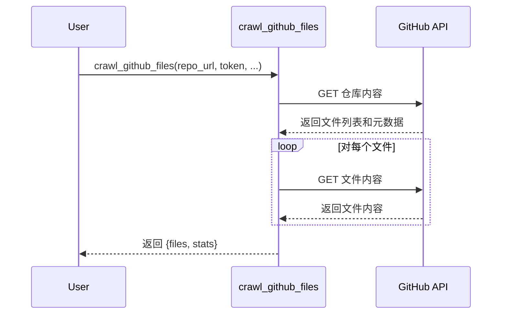

在上一章[PocketFlow框架](03_pocket_flow.mdx)中，我们了解了PocketFlow如何帮助我们管理教程生成过程中不同部分之间的数据流和执行流程。现在，让我们关注其中一个部分：从GitHub获取文件。这就是**GitHub文件爬虫**的用武之地。

想象一下，您想为一个托管在GitHub上的项目构建一个教程。您首先需要做的是从该仓库获取代码！GitHub文件爬虫就像一位图书管理员，能从广阔的图书馆（GitHub）中找到并检索特定的书籍（文件）。它负责从GitHub仓库获取文件，同时遵循大小限制、包含/排除模式和身份验证（如果需要）。它可以处理公共和私有仓库。

**为什么我们需要一个GitHub文件爬虫？**

想一想：我们想创建一个教程，但我们不想手动从仓库中的每个文件复制粘贴代码。那将是乏味且容易出错的！GitHub文件爬虫自动化了这个过程，使我们能轻松获取构建教程所需的文件。

**关键概念**

GitHub文件爬虫有几个关键概念：

1. **仓库URL：** 这是您想要爬取的GitHub仓库的地址。把它想象成图书馆的地址。

2. **GitHub令牌（可选）：** 如果仓库是私有的，或者您想为公共仓库避免速率限制，您需要提供一个GitHub个人访问令牌。这就像您的图书馆卡。

3. **包含/排除模式：** 这些允许您指定要包含或排除哪些文件。例如，您可能只想包含Python文件（`*.py`）或排除测试文件（`tests/*`）。这就像告诉图书管理员"我只想要关于编程的书"或"我不想要任何关于历史的书"。

4. **最大文件大小：** 这限制了下载文件的大小。这就像图书管理员说"我只能搬运重量低于5磅的书"。

**一个简单的例子**

假设我们想要爬取位于`https://github.com/your-username/my-cool-project`的公共GitHub仓库"my-cool-project"中的文件。我们只想包含Python文件（`*.py`）。

以下是我们如何使用`crawl_github_files`函数：

```python
from utils.crawl_github_files import crawl_github_files

repo_url = "https://github.com/your-username/my-cool-project"
include_patterns = "*.py"

result = crawl_github_files(repo_url, include_patterns=include_patterns)

files = result["files"]
stats = result["stats"]

print(f"Downloaded {stats['downloaded_count']} files.")
for filename, content in files.items():
    print(f"File: {filename}")
    # 现在可以处理文件内容了
```

**解释：**

* `from utils.crawl_github_files import crawl_github_files`：这行从`utils/crawl_github_files.py`文件导入`crawl_github_files`函数。
* `repo_url = "https://github.com/your-username/my-cool-project"`：这设置仓库URL为GitHub仓库的地址。
* `include_patterns = "*.py"`：这设置包含模式仅包含Python文件。
* `result = crawl_github_files(repo_url, include_patterns=include_patterns)`：这调用带有仓库URL和包含模式的`crawl_github_files`函数。
* `files = result["files"]`：这从结果中获取文件字典。键是文件路径，值是文件内容。
* `stats = result["stats"]`：这从结果中获取统计信息，如下载和跳过的文件数量。
* `print(f"Downloaded {stats['downloaded_count']} files.")`：这打印下载的文件数量。
* 循环然后遍历下载的文件并打印它们的文件名。然后您可以使用`files[filename]`访问每个文件的内容。

**示例输出**

运行上面的代码后，您可能会看到如下输出：

```
Downloaded 3 files.
File: my_cool_project/main.py
File: my_cool_project/utils.py
File: my_cool_project/config.py
```

这表明`crawl_github_files`函数成功地从仓库中下载了三个Python文件。

**同时使用包含和排除模式**

您也可以同时使用包含和排除模式来微调哪些文件被下载。例如，假设您想包含所有文件，但排除"tests"目录中的任何文件：

```python
from utils.crawl_github_files import crawl_github_files

repo_url = "https://github.com/your-username/my-cool-project"
exclude_patterns = "tests/*"

result = crawl_github_files(repo_url, exclude_patterns=exclude_patterns)

# ... （代码其余部分） ...
```

**内部原理：它是如何工作的**

让我们看看`crawl_github_files`函数内部发生了什么。

1. **解析仓库URL：** 函数首先解析仓库URL以提取所有者、仓库名称、分支/提交和路径。

2. **与GitHub进行身份验证（可选）：** 如果提供了GitHub令牌，函数使用它与GitHub API进行身份验证。

3. **获取文件内容：** 然后函数使用GitHub API获取仓库中的文件内容，同时遵循包含/排除模式和最大文件大小。

4. **返回结果：** 最后，函数返回一个包含下载文件和爬取统计信息的字典。

这里是一个简化的序列图：



**深入代码（文件：`utils/crawl_github_files.py`）**

让我们看看`crawl_github_files.py`文件中的一些关键代码片段：

```python
import requests
import fnmatch
from typing import Union, Set

def crawl_github_files(
    repo_url,
    token=None,
    include_patterns: Union[str, Set[str]] = None,
    exclude_patterns: Union[str, Set[str]] = None
):
    # ... （URL解析和认证） ...

    def should_include_file(file_path: str, file_name: str) -> bool:
        """根据模式确定文件是否应包含"""
        if not include_patterns:
            return True
        else:
            include_file = any(fnmatch.fnmatch(file_name, pattern) for pattern in include_patterns)

        if exclude_patterns and include_file:
            exclude_file = any(fnmatch.fnmatch(file_path, pattern) for pattern in exclude_patterns)
            return not exclude_file

        return include_file

    # ... （使用GitHub API获取文件内容） ...

    return {
        "files": files,
        "stats": {
            "downloaded_count": len(files),
            # ... （其他统计信息） ...
        }
    }
```

**解释：**

* `import requests`：这行导入`requests`库，用于向GitHub API发出HTTP请求。
* `import fnmatch`：这行导入`fnmatch`库，用于根据模式匹配文件名。
* `def should_include_file(...)`：这定义了一个辅助函数，根据包含和排除模式确定是否应包含文件。它使用`fnmatch.fnmatch`检查文件名是否匹配任何模式。
* 然后代码使用`requests`库向GitHub API发出HTTP请求以获取文件内容。它优雅地处理速率限制和错误。
* 最后，它返回一个包含下载文件和统计信息的字典。

**爬虫在我们项目中的应用**

在我们的教程生成项目中，GitHub文件爬虫是`FetchRepo`节点的核心组件。该节点使用爬虫从GitHub仓库获取内容，使其对后续节点可用，如用于识别关键抽象的`IdentifyAbstractions`节点。

GitHub文件爬虫的灵活性使我们能够优化要包含在教程中的内容。我们可以排除测试文件、文档、或者对理解项目不必要的其他文件。这确保了最终教程简洁且集中在最重要的概念上。

**总结**

GitHub文件爬虫是我们教程生成项目的关键组件。它使我们能够自动从GitHub仓库获取文件，而无需手动复制粘贴代码。通过支持包含/排除模式、身份验证和大小限制，它为我们提供了灵活性和控制力，确保我们只获取真正需要的文件。

现在我们了解了如何从GitHub获取文件，让我们探索我们项目的下一个关键部分：[大语言模型交互工具](05_llm_tools.mdx)，它负责分析代码并生成教程内容。


---

由[AI Codebase Knowledge Builder](https://github.com/The-Pocket/Tutorial-Codebase-Knowledge)生成 