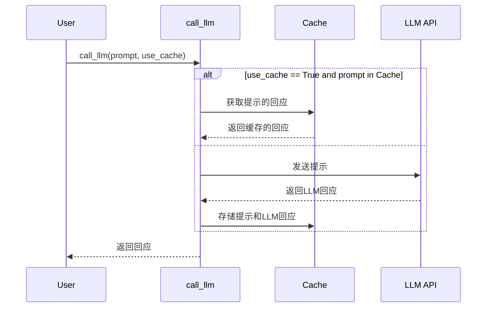

# 第5章：大语言模型交互工具

在上一章[GitHub文件爬虫](04_GitHub文件爬虫.mdx)中，我们学习了如何自动从GitHub仓库获取文件。现在我们有了代码，我们需要一种方法来*理解*它。这就是大语言模型(LLMs)的用武之地！但直接与LLM交谈可能很复杂。这就是为什么我们有大语言模型交互工具。

想象一下，你有一个精通编程的智慧朋友。你想问他们关于一段代码的问题，比如"这个函数做什么？"。大语言模型交互工具就像一个信使，帮助你将问题发送给这位智慧朋友(LLM)并获取他们的回答。它处理与LLM通信的所有技术细节，让你可以专注于提出正确的问题。

**为什么我们需要一个大语言模型交互工具？**

直接与LLMs交互可能很棘手。你需要处理以下事项：

* **认证：** 提供API密钥或凭证。
* **格式化提示：** 以LLM能理解的方式构建你的问题。
* **缓存：** 存储之前的回答，避免重复提出相同的问题(并节省费用！)。
* **日志记录：** 跟踪你的交互，用于调试和分析。

大语言模型交互工具简化了所有这些，提供了一个处理这些复杂性的单一函数。

**关键概念**

大语言模型交互工具，特别是`call_llm`函数，有几个关键概念：

1. **提示：** 这是你想问LLM的问题。把它想象成你发送给智慧朋友的消息。它应该清晰明确，这样LLM才能给你一个有帮助的回答。

2. **LLM(大语言模型)：** 这是回答你问题的"大脑"。例如谷歌的Gemini、Anthropic的Claude和OpenAI的模型。`call_llm`函数可以配置使用不同的LLMs。

3. **缓存：** 这是一种存储LLM回答的方式，这样你就不必再问同样的问题。就像把朋友的回答写在笔记本上，以便以后参考。

4. **日志记录：** 这是一种跟踪你与LLM所有交互的方式。就像保存与朋友对话的日记。

**一个简单的例子**

假设我们想问LLM："解释这个Python函数做什么：`def add(a, b): return a + b`"。

以下是我们如何使用`call_llm`函数：

```python
from utils.call_llm import call_llm

prompt = "解释这个Python函数做什么：`def add(a, b): return a + b`"
response = call_llm(prompt)

print(response)
```

**解释：**

* `from utils.call_llm import call_llm`：这行从`utils/call_llm.py`文件导入`call_llm`函数。
* `prompt = "解释这个Python函数做什么：`def add(a, b): return a + b`"`：这定义了提示，即我们想问LLM的问题。
* `response = call_llm(prompt)`：这调用带有提示的`call_llm`函数。该函数将提示发送给LLM并返回LLM的回应。
* `print(response)`：这将LLM的回应打印到控制台。

**示例输出**

运行上面的代码后，你可能会看到如下输出：

```
这个Python函数接受两个参数，a和b，并返回它们的和。
```

这表明`call_llm`函数成功地将提示发送给LLM并收到了一个有帮助的回应。

**使用`use_cache`参数**

`call_llm`函数还有一个`use_cache`参数。如果`use_cache`设置为`True`，函数会检查这个提示是否之前已经问过。如果已问过，函数会返回缓存的回应，而不是再次调用LLM。这可以节省时间和金钱。

```python
from utils.call_llm import call_llm

prompt = "解释这个Python函数做什么：`def add(a, b): return a + b`"

# 第一次调用 - 应该命中API
response1 = call_llm(prompt, use_cache=True)
print(f"回应1：{response1}")

# 第二次调用 - 应该使用缓存
response2 = call_llm(prompt, use_cache=True)
print(f"回应2：{response2}")
```

当你第一次运行这段代码时，`call_llm`函数会调用LLM并将回应存储在缓存中。当你第二次运行这段代码时，`call_llm`函数会从缓存中检索回应，而不是再次调用LLM。你会看到两次打印的相同回应，但第二次调用会快得多。

**内部原理：它是如何工作的**

让我们看看`call_llm`函数内部发生了什么。

1. **记录提示：** 函数首先将提示记录到日志文件中。这对调试和分析很有用。

2. **检查缓存（如果启用）：** 如果启用了缓存，函数会检查提示是否已经在缓存中。如果是，函数会返回缓存的回应。

3. **调用LLM（如果不在缓存中或缓存禁用）：** 如果提示不在缓存中，函数会调用LLM。这涉及：
   * 使用API密钥或凭证与LLM API进行认证。
   * 以LLM理解的方式格式化提示。
   * 将提示发送给LLM。
   * 接收LLM的回应。

4. **记录回应：** 函数将LLM的回应记录到日志文件中。

5. **更新缓存（如果启用）：** 如果启用了缓存，函数会将提示和LLM的回应添加到缓存中。

6. **返回回应：** 函数返回LLM的回应。

以下是一个简化的序列图：



**深入代码（文件：`utils/call_llm.py`）**

让我们看看`call_llm.py`文件中的一些关键代码片段：

```python
from google import genai
import os
import logging
import json
from datetime import datetime

# 配置日志记录
log_directory = os.getenv("LOG_DIR", "logs")
os.makedirs(log_directory, exist_ok=True)
log_file = os.path.join(log_directory, f"llm_calls_{datetime.now().strftime('%Y%m%d')}.log")

# 设置日志记录器
logger = logging.getLogger("llm_logger")
logger.setLevel(logging.INFO)
logger.propagate = False  # 防止传播到根日志记录器
file_handler = logging.FileHandler(log_file)
file_handler.setFormatter(logging.Formatter('%(asctime)s - %(levelname)s - %(message)s'))
logger.addHandler(file_handler)

# 简单的缓存配置
cache_file = "llm_cache.json"

# 默认情况下，我们使用Google Gemini 2.5 pro，因为它在代码理解方面表现出色
def call_llm(prompt: str, use_cache: bool = True) -> str:
    # 记录提示
    logger.info(f"PROMPT: {prompt}")
    
    # 如果启用，检查缓存
    if use_cache:
        # 从磁盘加载缓存
        cache = {}
        if os.path.exists(cache_file):
            try:
                with open(cache_file, 'r') as f:
                    cache = json.load(f)
            except:
                logger.warning(f"加载缓存失败，启动一个空缓存")
        
        # 如果存在，从缓存返回
        if prompt in cache:
            logger.info(f"RESPONSE: {cache[prompt]}")
            return cache[prompt]
    
    # 如果不在缓存中，调用LLM
```

---

由[AI Codebase Knowledge Builder](https://github.com/The-Pocket/Tutorial-Codebase-Knowledge)生成 