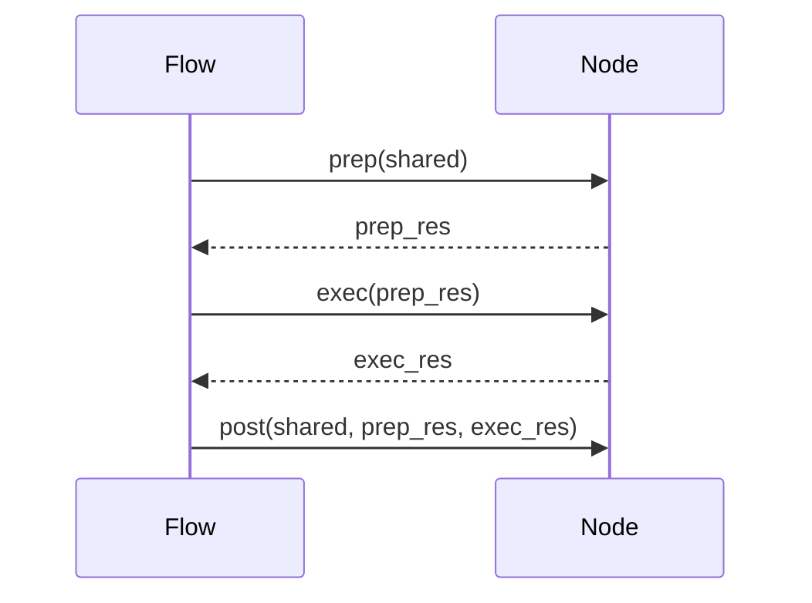

# 第6章：节点抽象

在上一章[大语言模型交互工具](05_大语言模型交互工具.mdx)中，我们学习了如何使用大语言模型来帮助我们理解和分析代码。现在，让我们关注如何组织我们的代码来执行教程生成过程中的不同任务。这就是**节点抽象**的用武之地。

想象一下你正在构建一个可以组装玩具车的机器人。你不会希望机器人一次完成*所有*事情，对吧？相反，你会将任务分解成更小、更可管理的步骤：

1. 拿起一个轮子。
2. 将轮子安装到轴上。
3. 对其他轮子重复相同的操作。
4. 将车身连接到底盘上。

这些步骤中的每一个都像一个节点。节点代表PocketFlow管道中的单个处理单元。它是我们流水线中的一个工人，负责特定任务。

**为什么我们需要节点抽象？**

节点抽象帮助我们：

* **分解复杂任务：** 它允许我们将教程生成过程分成更小、更易于管理的部分。
* **改进代码组织：** 它使我们的代码更加模块化且易于理解。
* **启用重用性：** 我们可以在不同的流程或项目中重用节点。
* **简化测试：** 我们可以独立测试每个节点。

**关键概念**

节点抽象的关键概念有：

1. **节点：** 基本构建块。它封装了一个特定任务。
2. **输入：** 节点接收到的用于执行其任务的数据。
3. **操作：** 节点对输入执行的处理。
4. **输出：** 节点操作的结果。
5. **`prep()`方法：** 在主处理之前准备输入数据。这是您可以从`shared`字典中获取数据并进行一些初始转换的地方。
6. **`exec()`方法：** 这是节点执行其核心操作的地方。它接收`prep()`方法的输出作为输入，并返回其处理的结果。
7. **`post()`方法：** 在`exec()`方法之后执行任何必要的后处理步骤。这是您可以将节点的输出存储在`shared`字典中供其他节点使用的地方。
8. **`BatchNode`：** 一种特殊类型的节点，可以一次处理多个项目。把它想象成一个可以并行处理大量任务的工人团队。

**一个简单的例子**

让我们创建一个将文本转换为大写的简单节点：

```python
from pocketflow import Node

class UppercaseNode(Node):
    def prep(self, shared):
        text = shared.get("text", "") # 从shared字典中获取文本
        return text # 将文本传递给exec方法

    def exec(self, text):
        # 将文本转换为大写
        uppercase_text = text.upper()
        return uppercase_text

    def post(self, shared, prep_res, exec_res):
        shared["uppercase_text"] = exec_res # 将结果存储在shared字典中
```

**解释：**

* `from pocketflow import Node`：这行从`pocketflow`库导入`Node`类。
* `class UppercaseNode(Node):`：这定义了一个名为`UppercaseNode`的类，继承自`Node`类。
* `def prep(self, shared):`：`prep`方法从`shared`字典中获取输入文本。如果"text"键不存在，它默认为空字符串。然后它返回文本，这将作为输入传递给`exec`方法。
* `def exec(self, text):`：`exec`方法接收输入文本并使用`upper()`方法将其转换为大写。
* `def post(self, shared, prep_res, exec_res):`：`post`方法将大写文本存储在`shared`字典中，键为"uppercase_text"。

**使用节点**

以下是我们如何在流程中使用`UppercaseNode`：

```python
from pocketflow import Flow
from pocketflow import Node # 导入Node类
# （包括上面的UppercaseNode定义）

# 实例化节点
uppercase_node = UppercaseNode()

# 创建流程
flow = Flow(start=uppercase_node)

# 准备共享数据
shared_data = {"text": "hello, world!"}

# 运行流程
flow.run(shared_data)

# 打印结果
print(shared_data["uppercase_text"])  # 输出: HELLO, WORLD!
```

**解释：**

* 我们实例化`UppercaseNode`。
* 我们创建一个以`UppercaseNode`为起点的`Flow`。
* 我们创建一个包含输入文本的`shared_data`字典。
* 我们运行流程，传入`shared_data`。
* `UppercaseNode`处理文本并将大写版本存储在`shared_data`中。
* 最后，我们从`shared_data`中打印大写文本。

**节点生命周期**

以下是说明节点生命周期的序列图：



**解释：**

1. `Flow`调用`Node`的`prep()`方法，传入`shared`字典。
2. `Node`执行任何必要的准备工作并将`prep_res`（准备好的结果）返回给`Flow`。
3. `Flow`调用`Node`的`exec()`方法，传入`prep_res`。
4. `Node`执行其核心操作并将`exec_res`（执行结果）返回给`Flow`。
5. `Flow`调用`Node`的`post()`方法，传入`shared`字典、`prep_res`和`exec_res`。

**`BatchNode`：处理多个项目**

有时，您需要一次处理多个项目。这就是`BatchNode`的用处。比如说你有一个句子列表，想把每个句子翻译成西班牙语。`BatchNode`将非常适合这个任务。

下面是一个例子：

```python
from pocketflow import BatchNode

class TranslateSentences(BatchNode):
    def prep(self, shared):
        sentences = shared.get("sentences", [])
        return sentences # 准备句子列表

    def exec(self, sentence):
        # 模拟翻译
        translated_sentence = f"已翻译: {sentence}"
        return translated_sentence

    def post(self, shared, prep_res, exec_res_list):
        shared["translated_sentences"] = exec_res_list
```

**解释：**

* `from pocketflow import BatchNode`：这导入了`BatchNode`类。
* `prep`方法准备了一个要翻译的句子列表。
* `exec`方法翻译一个*单一*句子。注意`exec`只接收一个句子作为输入，而不是一个列表。
* `post`方法将翻译后的句子列表存储在`shared`字典中。

**`BatchNode`如何工作**

`BatchNode`自动遍历`prep()`返回的列表，并对每个项目调用`exec()`。结果被收集到一个列表中，然后传递给`post()`。

**我们教程生成项目中的节点**

让我们看一下我们在教程生成项目中使用的一些节点（来自`nodes.py`）：

* **`FetchRepo`：** 从GitHub仓库获取文件。我们在[GitHub文件爬虫](04_GitHub文件爬虫.mdx)中看到了这一点。
* **`IdentifyAbstractions`：** 使用LLM识别代码库中的关键抽象。
* **`AnalyzeRelationships`：** 使用LLM分析已识别抽象之间的关系。
* **`OrderChapters`：** 使用LLM确定在教程中解释抽象的最佳顺序。
* **`WriteChapters`：** 使用LLM为每个抽象编写单独的章节。这是一个`BatchNode`，因为它生成多个章节。
* **`CombineTutorial`：** 将单独的章节组合成一个完整的教程。

**例子：`FetchRepo`节点**

让我们更详细地看一下`FetchRepo`节点：

```python
class FetchRepo(Node):
    def prep(self, shared):
        repo_url = shared["repo_url"]
        project_name = shared.get("project_name")
        if not project_name:
            project_name = repo_url.split('/')[-1].replace('.git', '')
            shared["project_name"] = project_name

        include_patterns = shared.get("include_patterns", None)
        exclude_patterns = shared.get("exclude_patterns", None)
        token = shared.get("github_token", None)
        
        return {
            "repo_url": repo_url,
            "include_patterns": include_patterns,
            "exclude_patterns": exclude_patterns,
            "token": token
        }
    
    def exec(self, prep_res):
        repo_url = prep_res["repo_url"]
        include_patterns = prep_res["include_patterns"]
        exclude_patterns = prep_res["exclude_patterns"]
        token = prep_res["token"]
        
        # 使用我们之前看到的crawl_github_files函数
        result = crawl_github_files(
            repo_url,
            token=token,
            include_patterns=include_patterns,
            exclude_patterns=exclude_patterns
        )
        
        return result
    
    def post(self, shared, prep_res, exec_res):
        # 将结果存储在shared字典中
        shared["files"] = exec_res["files"]
        shared["repo_stats"] = exec_res["stats"]
        
        print(f"从仓库获取了 {len(shared['files'])} 个文件。")
```

**解释：**

* `prep`方法从`shared`字典中获取仓库URL、项目名称（如果未提供，则从URL派生）、包含/排除模式和GitHub令牌。
* `exec`方法调用`crawl_github_files`函数获取仓库中的文件。
* `post`方法将获取的文件和统计信息存储在`shared`字典中，并打印获取的文件数量。

**例子：`WriteChapters`节点（一个BatchNode）**

`WriteChapters`节点负责为每个抽象编写单独的章节。由于它需要生成多个章节，它是一个`BatchNode`：

```python
class WriteChapters(BatchNode):
    def __init__(self, max_retries=0, wait=0):
        super().__init__(max_retries=max_retries, wait=wait)
    
    def prep(self, shared):
        abstractions = shared["ordered_abstractions"]
        project_name = shared["project_name"]
        files = shared["files"]
        
        return abstractions
    
    def exec(self, abstraction):
        project_name = self.shared["project_name"]
        files = self.shared["files"]
        
        # 获取与抽象相关的文件
        relevant_files = {}
        for file_path, content in files.items():
            if abstraction["name"].lower() in file_path.lower():
                relevant_files[file_path] = content
        
        # 使用LLM编写章节
        prompt = f"""
        为项目 "{project_name}" 编写一个关于 "{abstraction['name']}" 的教程章节。
        
        该抽象的描述：{abstraction['description']}
        
        相关文件：
        {list(relevant_files.keys())}
        
        章节应该解释概念，并提供代码示例和解释。
        使用友好、易懂的语气面向初学者。
        章节应该是独立的，但也应提及相关抽象：{abstraction['related']}
        """
        
        chapter_content = call_llm(prompt)
        
        return {
            "name": abstraction["name"],
            "content": chapter_content,
            "related": abstraction["related"]
        }
    
    def post(self, shared, prep_res, exec_res_list):
        # 将生成的章节存储在shared字典中
        shared["chapters"] = exec_res_list
        
        print(f"生成了 {len(exec_res_list)} 个章节。")
```

**解释：**

* `prep`方法从`shared`字典中获取`ordered_abstractions`（我们要为其编写章节的抽象列表）。
* `exec`方法为单个抽象编写章节。它使用`call_llm`函数根据提示生成章节内容。
* `post`方法将生成的章节存储在`shared`字典中，并打印生成的章节数量。

**结论**

节点抽象是我们教程生成流程的基础。它使我们能够将复杂的教程生成过程分解为更小、更易于管理的步骤，每个步骤都有明确定义的职责。通过理解节点、它们的生命周期和组合方式，我们可以创建强大而灵活的教程生成管道。

---

由[AI Codebase Knowledge Builder](https://github.com/The-Pocket/Tutorial-Codebase-Knowledge)生成 