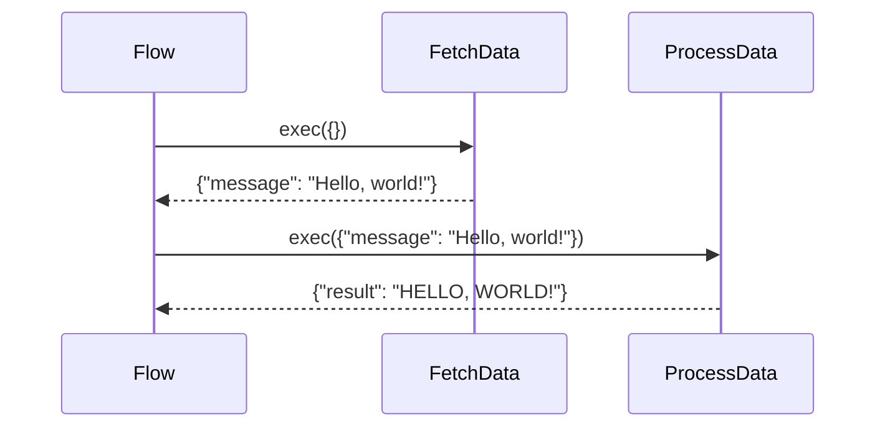

# 第3章：PocketFlow 框架

在上一章 [教程生成流程](/chapters/02_tutorial_generation_flow) 中，我们了解了教程创建过程是如何被结构化为一系列步骤的。但我们究竟如何*管理*这个序列呢？我们如何确保每个步骤以正确的顺序执行，并且数据在它们之间无缝传递？这就是 PocketFlow 框架的用武之地！

**什么是 PocketFlow？**

PocketFlow 是一个轻量级框架，用于构建数据处理管道。把它想象成一条流水线，每个工作站（节点）执行一个特定任务，然后将结果传递给下一个工作站。它允许您以结构化和可管理的方式定义操作序列（如获取数据、分析数据和写入结果）。它提供了一个结构来管理不同组件之间的数据流和执行流程。

想象一下你正在制造一辆汽车。你不会随意地组装零件，对吧？你会有一个系统：

1. 安装底盘。
2. 安装发动机。
3. 添加车轮。
4. 给汽车上漆。

PocketFlow 帮助我们在教程生成过程中做同样的事情。它提供了连接这些不同步骤的结构。

**为什么我们需要 PocketFlow？**

没有像 PocketFlow 这样的框架，管理教程生成流程会困难得多。我们将不得不手动跟踪执行顺序、处理数据传递以及管理错误。PocketFlow 简化了所有这些工作，使我们的代码更有组织、更易读和更易维护。

**核心概念**

PocketFlow 围绕两个核心概念展开：

1. **节点：** 这些是管道中的各个步骤，正如我们在 [教程生成流程](/chapters/02_tutorial_generation_flow) 中讨论的那样。每个节点执行一个特定任务，如从 GitHub 获取数据或撰写教程章节。

2. **流程：** 流程定义了节点执行的顺序。它就像一个食谱，告诉框架在哪个节点之后运行哪个节点。

**一个简单示例**

让我们考虑一个简化的教程生成流程，包含两个节点：

1. **FetchData：** 从源（例如，GitHub 仓库）获取数据。
2. **ProcessData：** 处理获取的数据（例如，分析代码）。

使用 PocketFlow，我们可以这样定义这个流程：

```python
from pocketflow import Flow, Node

class FetchData(Node):
    def exec(self, input_data):
        # 模拟获取数据
        data = {"message": "Hello, world!"}
        return data

class ProcessData(Node):
    def exec(self, input_data):
        # 模拟处理数据
        message = input_data["message"]
        processed_message = message.upper()
        return {"result": processed_message}

# 实例化节点
fetch_data = FetchData()
process_data = ProcessData()

# 定义流程
fetch_data >> process_data  # FetchData 的输出成为 ProcessData 的输入

# 创建流程
flow = Flow(start=fetch_data)

# 运行流程
result = flow.run({}) # 以空输入开始
print(result) # 输出: {'result': 'HELLO, WORLD!'}
```

**解释：**

* `from pocketflow import Flow, Node`：这行从 `pocketflow` 库导入 `Flow` 和 `Node` 类。
* `class FetchData(Node):`：这定义了一个名为 `FetchData` 的节点，它继承自 `Node` 类。
* `def exec(self, input_data):`：这定义了 `exec` 方法，它是节点的核心。它接收输入数据，执行一些处理，然后返回结果。
* `fetch_data >> process_data`：这行通过使用 `>>` 运算符将 `FetchData` 节点连接到 `ProcessData` 节点来定义流程。这意味着 `FetchData` 的输出将作为输入传递给 `ProcessData`。
* `flow = Flow(start=fetch_data)`：这创建了 `Flow` 类的一个实例，指定 `FetchData` 节点为起点。
* `result = flow.run({})`：这运行流程，从 `FetchData` 节点开始，并传入一个空字典作为初始输入。

**深入了解：它是如何工作的**

当你调用 `flow.run()` 时，PocketFlow 会执行以下操作：

1. 它从起始节点（在我们的例子中是 `FetchData`）开始。
2. 它调用节点的 `exec()` 方法，传入输入数据。
3. 它取 `exec()` 方法的输出并将其作为输入传递给流程中的下一个节点（通过 `>>` 连接）。
4. 它重复步骤 2 和 3，直到流程中的所有节点都被执行。
5. 它返回流程中最后一个节点的输出。

以下是一个简化的序列图：



**深入代码（文件：`pocketflow.py` - 简化版）**

虽然实际的 `pocketflow.py` 文件可能包含更多功能，但这里是一个简化版本，用于说明核心概念：

```python
class Node:
    def prep(self, shared):
        """可选的准备步骤。可以修改共享数据。"""
        return None # 默认实现

    def exec(self, prep_res):
        """必须由子类实现。执行节点的任务。"""
        raise NotImplementedError("exec() 必须由子类实现")

    def post(self, shared, prep_res, exec_res):
        """可选的后处理步骤。可以修改共享数据。"""
        pass # 默认实现

    def __rshift__(self, other_node):
        """重载 >> 运算符，用于在流程中连接节点。"""
        return FlowConnection(self, other_node)

class FlowConnection:
    """表示两个节点之间的连接。"""
    def __init__(self, from_node, to_node):
        self.from_node = from_node
        self.to_node = to_node

class Flow:
    def __init__(self, start):
        self.start = start
        self.nodes = self._build_node_list(start)

    def _build_node_list(self, start_node):
        """构建流程中的节点列表。"""
        nodes = []
        current_node = start_node
        while current_node:
            nodes.append(current_node)
            if hasattr(current_node, '__flow_connection__'):
                current_node = current_node.__flow_connection__.to_node
            else:
                current_node = None
        return nodes

    def run(self, shared):
        """运行流程。"""
        current_node = self.start
        prep_res = None
        exec_res = None
        node_results = {} # 存储结果以避免重新计算

        for node in self.nodes:
            # 准备步骤
            prep_res = node.prep(shared)

            # 执行步骤
            exec_res = node.exec(prep_res)

            # 后处理步骤
            node.post(shared, prep_res, exec_res)

        return shared # 返回最终的共享数据
```

**解释：**

* `class Node:`：这定义了基础 `Node` 类。它包括 `prep`、`exec` 和 `post` 方法，这些是每个节点功能的核心。
    * `prep`：为 `exec` 方法准备数据。它接收一个在节点之间传递数据的共享字典，并返回一个为 `exec` 方法准备的结果。
    * `exec`：执行节点的核心逻辑。它接收来自 `prep` 方法的准备结果，并返回一个结果给 `post` 方法。
    * `post`：在 `exec` 方法之后执行后处理。它接收共享字典、来自 `prep` 方法的准备结果和来自 `exec` 方法的结果。

* `__rshift__(self, other_node)`：这个特殊方法重载了 `>>` 运算符，允许我们在流程中连接节点。

* `class Flow:`：这定义了 `Flow` 类，它管理节点的执行。
    * `run(self, shared)`：这个方法运行流程，按正确顺序执行每个节点并在它们之间传递数据。它接收一个 `shared` 字典作为输入，这个字典可以用于在节点之间传递数据。

**PocketFlow 在项目中的使用**

在我们的教程生成项目中，PocketFlow 在 `flow.py` 文件中用于定义教程生成流程。`create_tutorial_flow` 函数使用 PocketFlow 创建一个包含以下节点的流程：

- FetchRepo：从 GitHub 获取代码。
- IdentifyAbstractions：使用 LLM 识别代码中的关键抽象。
- AnalyzeRelationships：分析抽象之间的关系。
- OrderChapters：决定教程中解释抽象的最佳顺序。
- WriteChapters：为每个抽象写一个章节。
- CombineTutorial：将各个章节组合成一个完整的教程。

**总结**

PocketFlow 框架是我们教程生成项目的基础。它提供了管理教程生成流程各个步骤的结构。通过使用 PocketFlow，我们可以创建一个清晰、模块化和可维护的流程，将 GitHub 仓库转换为全面的教程。

在下一章中，我们将深入了解 [GitHub 文件爬虫](/chapters/04_github_file_crawler)，它负责从 GitHub 获取代码。

---

由 [AI 代码库知识构建器](https://github.com/The-Pocket/Tutorial-Codebase-Knowledge) 生成 