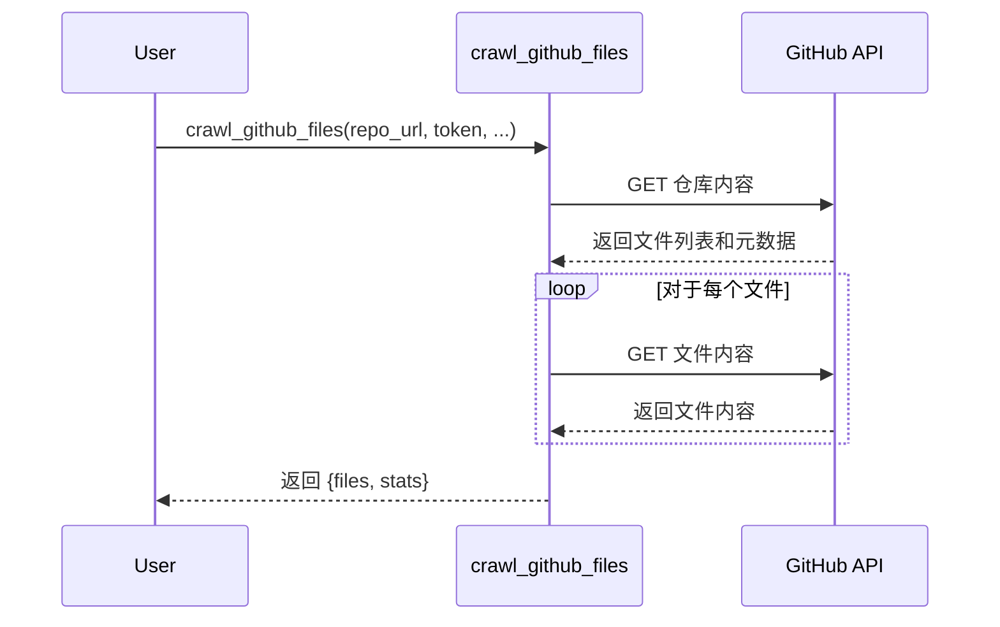

# 第4章：GitHub 文件爬虫

在上一章 [PocketFlow 框架](/chapters/03_pocketflow_framework) 中，我们了解了 PocketFlow 如何帮助我们管理教程生成过程中不同部分之间的数据流和执行流程。现在，让我们深入了解其中一个部分：从 GitHub 获取文件。这就是 **GitHub 文件爬虫** 发挥作用的地方。

想象一下，你想为托管在 GitHub 上的项目构建一个教程。首先，你需要从该仓库获取代码！GitHub 文件爬虫就像一个能从广阔的图书馆（GitHub）中找到并检索特定书籍（文件）的图书管理员。它负责从 GitHub 仓库获取文件，遵守大小限制、包含/排除模式和身份验证（如果需要）。它可以处理公共和私有仓库。

**为什么我们需要 GitHub 文件爬虫？**

想一想：我们想创建一个教程，但我们不想手动复制粘贴仓库中每个文件的代码。那将是乏味且容易出错的！GitHub 文件爬虫自动化了这个过程，使获取构建教程所需的文件变得容易。

**核心概念**

GitHub 文件爬虫有几个关键概念：

1. **仓库 URL：** 这是你要爬取的 GitHub 仓库的地址。可以把它看作图书馆的地址。

2. **GitHub 令牌（可选）：** 如果仓库是私有的，或者如果你想避免公共仓库的速率限制，你需要提供一个 GitHub 个人访问令牌。这就像你的图书馆卡。

3. **包含/排除模式：** 这些允许你指定要包含或排除哪些文件。例如，你可能只想包含 Python 文件（`*.py`）或排除测试文件（`tests/*`）。这就像告诉图书管理员"我只想要关于编程的书"或"我不想要任何关于历史的书"。

4. **最大文件大小：** 这限制了下载的文件大小。这就像图书管理员说"我只能携带重量少于 5 磅的书"。

**一个简单示例**

假设我们想从位于 `https://github.com/your-username/my-cool-project` 的公共 GitHub 仓库 "my-cool-project" 爬取文件。我们只想包含 Python 文件（`*.py`）。

以下是我们如何使用 `crawl_github_files` 函数：

```python
from utils.crawl_github_files import crawl_github_files

repo_url = "https://github.com/your-username/my-cool-project"
include_patterns = "*.py"

result = crawl_github_files(repo_url, include_patterns=include_patterns)

files = result["files"]
stats = result["stats"]

print(f"下载了 {stats['downloaded_count']} 个文件。")
for filename, content in files.items():
    print(f"文件：{filename}")
    # 现在你可以处理文件内容
```

**解释：**

* `from utils.crawl_github_files import crawl_github_files`：这行从 `utils/crawl_github_files.py` 文件导入 `crawl_github_files` 函数。
* `repo_url = "https://github.com/your-username/my-cool-project"`：这设置了仓库 URL 为 GitHub 仓库的地址。
* `include_patterns = "*.py"`：这设置了包含模式仅包含 Python 文件。
* `result = crawl_github_files(repo_url, include_patterns=include_patterns)`：这以仓库 URL 和包含模式调用 `crawl_github_files` 函数。
* `files = result["files"]`：这从结果中获取文件字典。键是文件路径，值是文件内容。
* `stats = result["stats"]`：这从结果中获取统计信息，如下载和跳过的文件数量。
* `print(f"下载了 {stats['downloaded_count']} 个文件。")`：这打印下载的文件数量。
* 循环然后遍历下载的文件并打印它们的文件名。然后你可以使用 `files[filename]` 访问每个文件的内容。

**示例输出**

运行上面的代码后，你可能会看到类似这样的输出：

```
下载了 3 个文件。
文件：my_cool_project/main.py
文件：my_cool_project/utils.py
文件：my_cool_project/config.py
```

这表明 `crawl_github_files` 函数成功地从仓库中下载了三个 Python 文件。

**使用包含和排除模式**

你也可以将包含和排除模式结合起来，以微调下载哪些文件。例如，假设你想包含所有文件，但排除 "tests" 目录中的任何文件：

```python
from utils.crawl_github_files import crawl_github_files

repo_url = "https://github.com/your-username/my-cool-project"
exclude_patterns = "tests/*"

result = crawl_github_files(repo_url, exclude_patterns=exclude_patterns)

# ... （代码其余部分）...
```

**深入了解：它是如何工作的**

让我们看看 `crawl_github_files` 函数内部发生了什么。

1. **解析仓库 URL：** 该函数首先解析仓库 URL 以提取所有者、仓库名称、分支/提交和路径。

2. **与 GitHub 进行身份验证（可选）：** 如果提供了 GitHub 令牌，该函数使用它来与 GitHub API 进行身份验证。

3. **获取文件内容：** 然后该函数使用 GitHub API 获取仓库中文件的内容，遵守包含/排除模式和最大文件大小。

4. **返回结果：** 最后，该函数返回一个包含下载的文件和有关爬取统计信息的字典。

以下是一个简化的序列图：



**深入代码（文件：`utils/crawl_github_files.py`）**

让我们看看 `crawl_github_files.py` 文件中的一些关键片段：

```python
import requests
import fnmatch
from typing import Union, Set

def crawl_github_files(
    repo_url,
    token=None,
    include_patterns: Union[str, Set[str]] = None,
    exclude_patterns: Union[str, Set[str]] = None
):
    # ... （URL 解析和身份验证）...

    def should_include_file(file_path: str, file_name: str) -> bool:
        """根据模式确定是否应包含文件"""
        if not include_patterns:
            return True
        else:
            include_file = any(fnmatch.fnmatch(file_name, pattern) for pattern in include_patterns)

        if exclude_patterns and include_file:
            exclude_file = any(fnmatch.fnmatch(file_path, pattern) for pattern in exclude_patterns)
            return not exclude_file

        return include_file

    # ... （使用 GitHub API 获取文件内容）...

    return {
        "files": files,
        "stats": {
            "downloaded_count": len(files),
            # ... （其他统计信息）...
        }
    }
```

**解释：**

* `import requests`：这行导入 `requests` 库，用于向 GitHub API 发出 HTTP 请求。
* `import fnmatch`：这行导入 `fnmatch` 库，用于将文件名与模式匹配。
* `def should_include_file(...)`：这定义了一个辅助函数，根据包含和排除模式确定是否应包含文件。它使用 `fnmatch.fnmatch` 检查文件名是否匹配任何模式。
* 然后代码使用 `requests` 库向 GitHub API 发出 HTTP 请求以获取文件内容。它优雅地处理速率限制和错误。
* 最后，它返回一个包含下载的文件和统计信息的字典。

**SSH 克隆**

`crawl_github_files` 函数还支持通过 SSH 克隆仓库。这对于你不想提供 GitHub 令牌的私有仓库很有用。

```python
import git
import tempfile

def crawl_github_files(repo_url, token=None):
    # 检测 SSH URL（git@ 或 .git 后缀）
    is_ssh_url = repo_url.startswith('git@') or repo_url.endswith('.git')
    
    if is_ssh_url:
        # 创建临时目录
        with tempfile.TemporaryDirectory() as temp_dir:
            # 克隆仓库
            git.Repo.clone_from(repo_url, temp_dir)
            
            # 处理文件...
```

**在教程生成流程中的应用**

在我们的教程生成项目中，GitHub 文件爬虫作为 `FetchRepo` 节点的一部分使用。这是教程生成流程中的第一个节点，它获取要分析的代码库。

```python
class FetchRepo(Node):
    def prep(self, shared):
        repo_url = shared.get("repo_url")
        token = shared.get("github_token")
        include_patterns = shared.get("include_patterns")
        exclude_patterns = shared.get("exclude_patterns")
        
        return {
            "repo_url": repo_url,
            "token": token,
            "include_patterns": include_patterns,
            "exclude_patterns": exclude_patterns
        }
        
    def exec(self, prep_res):
        result = crawl_github_files(
            prep_res["repo_url"],
            token=prep_res["token"],
            include_patterns=prep_res["include_patterns"],
            exclude_patterns=prep_res["exclude_patterns"]
        )
        
        return result
        
    def post(self, shared, prep_res, exec_res):
        shared["files"] = exec_res["files"]
        shared["files_stats"] = exec_res["stats"]
```

**解释：**

* `def prep(self, shared)`：这个方法从 `shared` 字典中获取必要的参数，如 `repo_url`、`token`、`include_patterns` 和 `exclude_patterns`。
* `def exec(self, prep_res)`：这个方法调用 `crawl_github_files` 函数，传入从 `prep` 方法获取的参数。
* `def post(self, shared, prep_res, exec_res)`：这个方法将函数的结果存储在 `shared` 字典中，使其可供流程中的其他节点使用。

**总结**

GitHub 文件爬虫是我们教程生成项目的重要组成部分。它允许我们轻松获取要分析的代码库。通过提供灵活的选项，如包含/排除模式和 GitHub 令牌支持，它可以处理各种场景。

在下一章中，我们将探讨 [LLM 交互工具](/chapters/05_llm_interaction_utility)，它允许我们与大型语言模型进行交互以生成教程内容。

---

由 [AI 代码库知识构建器](https://github.com/The-Pocket/Tutorial-Codebase-Knowledge) 生成 