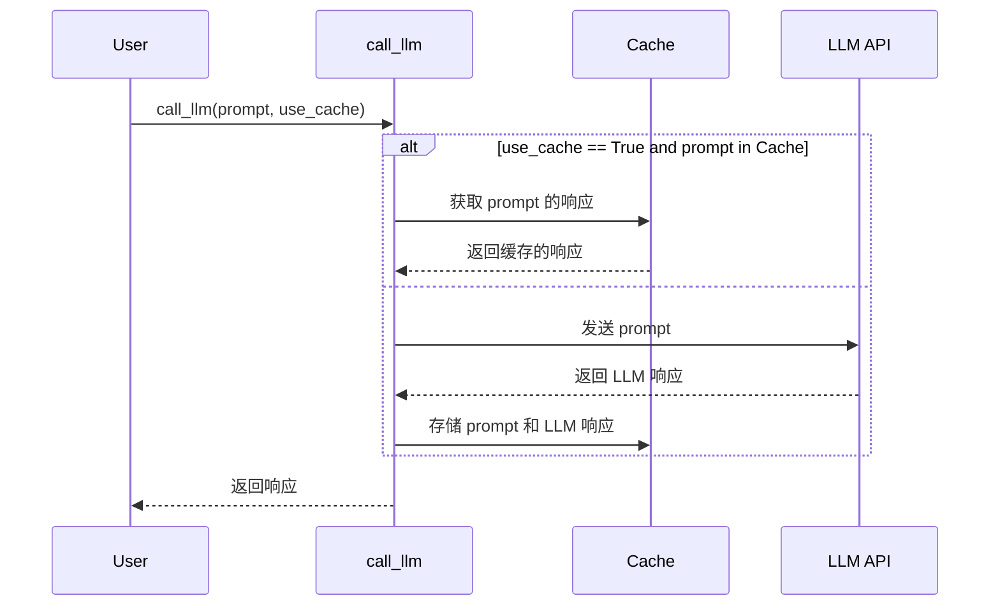

# 第5章：LLM 交互工具

在上一章 [GitHub 文件爬虫](/chapters/04_github_file_crawler) 中，我们了解了如何自动从 GitHub 仓库获取文件。现在我们有了代码，我们需要一种方法来*理解*它。这就是大型语言模型 (LLM) 发挥作用的地方！但直接与 LLM 交谈可能很复杂。这就是为什么我们有 LLM 交互工具。

想象一下，你有一位懂编程的智慧朋友。你想向他们询问有关一段代码的问题，比如"这个函数是做什么的？"。LLM 交互工具就像一位帮助你将问题发送给这位智慧朋友（LLM）并获取其回答的信使。它处理与 LLM 通信的所有技术细节，所以你可以专注于提出正确的问题。

**为什么我们需要 LLM 交互工具？**

直接与 LLM 交互可能很棘手。你需要处理以下事项：

* **认证：** 提供 API 密钥或凭证。
* **格式化提示：** 以 LLM 能理解的方式构建问题。
* **缓存：** 存储先前的回答，避免重复询问相同的问题（并节省费用！）。
* **日志记录：** 跟踪你的交互，用于调试和分析。

LLM 交互工具简化了所有这些，提供了一个处理这些复杂性的单一函数。

**核心概念**

LLM 交互工具，特别是 `call_llm` 函数，有几个关键概念：

1. **提示：** 这是你想问 LLM 的问题。把它看作你发送给智慧朋友的消息。它应该清晰明确，这样 LLM 才能给你有用的回答。

2. **LLM（大型语言模型）：** 这是回答你问题的"大脑"。例子包括 Google 的 Gemini、Anthropic 的 Claude 和 OpenAI 的模型。`call_llm` 函数可以配置为使用不同的 LLM。

3. **缓存：** 这是一种存储 LLM 回答的方式，这样你就不必再次询问相同的问题。这就像在笔记本上写下朋友的回答，以便后续参考。

4. **日志记录：** 这是一种跟踪你与 LLM 所有交互的方式。这就像保存你与朋友对话的日记。

**一个简单示例**

假设我们想问 LLM："解释这个 Python 函数做什么：`def add(a, b): return a + b`"。

以下是我们如何使用 `call_llm` 函数：

```python
from utils.call_llm import call_llm

prompt = "解释这个 Python 函数做什么：`def add(a, b): return a + b`"
response = call_llm(prompt)

print(response)
```

**解释：**

* `from utils.call_llm import call_llm`：这行从 `utils/call_llm.py` 文件导入 `call_llm` 函数。
* `prompt = "解释这个 Python 函数做什么：`def add(a, b): return a + b`"`：这定义了提示，即我们想问 LLM 的问题。
* `response = call_llm(prompt)`：这调用 `call_llm` 函数，传入提示。该函数将提示发送给 LLM 并返回 LLM 的响应。
* `print(response)`：这将 LLM 的响应打印到控制台。

**示例输出**

运行上面的代码后，你可能会看到如下输出：

```
这个 Python 函数接受两个参数 a 和 b，并返回它们的和。
```

这表明 `call_llm` 函数成功地将提示发送给 LLM 并接收到了有用的响应。

**使用 `use_cache` 参数**

`call_llm` 函数还有一个 `use_cache` 参数。如果 `use_cache` 设置为 `True`，该函数将检查提示是否已经被问过。如果已问过，函数将返回缓存的响应，而不是再次调用 LLM。这可以节省时间和金钱。

```python
from utils.call_llm import call_llm

prompt = "解释这个 Python 函数做什么：`def add(a, b): return a + b`"

# 第一次调用 - 应该调用 API
response1 = call_llm(prompt, use_cache=True)
print(f"响应 1：{response1}")

# 第二次调用 - 应该使用缓存
response2 = call_llm(prompt, use_cache=True)
print(f"响应 2：{response2}")
```

第一次运行这段代码时，`call_llm` 函数将调用 LLM 并将响应存储在缓存中。第二次运行这段代码时，`call_llm` 函数将从缓存中检索响应，而不是再次调用 LLM。你会看到相同的响应打印两次，但第二次调用会快得多。

**深入了解：它是如何工作的**

让我们看看 `call_llm` 函数内部发生了什么。

1. **记录提示：** 该函数首先将提示记录到日志文件中。这对调试和分析很有用。

2. **检查缓存（如果启用）：** 如果启用了缓存，该函数会检查提示是否已经在缓存中。如果是，函数返回缓存的响应。

3. **调用 LLM（如果不在缓存中或缓存已禁用）：** 如果提示不在缓存中，该函数会调用 LLM。这涉及：
   * 使用 API 密钥或凭证与 LLM API 进行认证。
   * 以 LLM 能理解的方式格式化提示。
   * 将提示发送给 LLM。
   * 接收 LLM 的响应。

4. **记录响应：** 该函数将 LLM 的响应记录到日志文件。

5. **更新缓存（如果启用）：** 如果启用了缓存，该函数将提示和 LLM 的响应添加到缓存中。

6. **返回响应：** 该函数返回 LLM 的响应。

以下是一个简化的序列图：



**深入代码（文件：`utils/call_llm.py`）**

让我们看看 `call_llm.py` 文件中的一些关键片段：

```python
from google import genai
import os
import logging
import json
from datetime import datetime

# 配置日志记录
log_directory = os.getenv("LOG_DIR", "logs")
os.makedirs(log_directory, exist_ok=True)
log_file = os.path.join(log_directory, f"llm_calls_{datetime.now().strftime('%Y%m%d')}.log")

# 设置日志记录器
logger = logging.getLogger("llm_logger")
logger.setLevel(logging.INFO)
logger.propagate = False  # 防止传播到根日志记录器
file_handler = logging.FileHandler(log_file)
file_handler.setFormatter(logging.Formatter('%(asctime)s - %(levelname)s - %(message)s'))
logger.addHandler(file_handler)

# 简单缓存配置
cache_file = "llm_cache.json"

# 默认情况下，我们使用 Google Gemini 2.5 pro，因为它在代码理解方面表现出色
def call_llm(prompt: str, use_cache: bool = True) -> str:
    # 记录提示
    logger.info(f"PROMPT: {prompt}")
    
    # 如果启用，检查缓存
    if use_cache:
        # 从磁盘加载缓存
        cache = {}
        if os.path.exists(cache_file):
            try:
                with open(cache_file, 'r') as f:
                    cache = json.load(f)
            except:
                logger.warning(f"加载缓存失败，使用空缓存开始")
        
        # 如果存在，从缓存返回
        if prompt in cache:
            logger.info(f"RESPONSE: {cache[prompt]}")
            return cache[prompt]
    
    # 如果不在缓存中，调用 LLM
    try:
        # 确保我们有相关 API 密钥
        api_key = os.getenv("GEMINI_API_KEY")
        if not api_key:
            raise ValueError("找不到 GEMINI_API_KEY 环境变量")
            
        # 配置 Google Gemini 客户端
        genai.configure(api_key=api_key)
        
        # 为代码理解选择 Gemini Pro 模型
        model = genai.GenerativeModel('gemini-pro')
        
        # 调用 API 并获取响应
        response = model.generate_content(prompt)
        
        # 提取文本响应
        result = response.text
        
        # 记录响应
        logger.info(f"RESPONSE: {result}")
        
        # 如果启用，更新缓存
        if use_cache:
            cache[prompt] = result
            with open(cache_file, 'w') as f:
                json.dump(cache, f)
        
        return result
    except Exception as e:
        error_msg = f"调用 LLM 时出错：{str(e)}"
        logger.error(error_msg)
        return f"错误：{error_msg}"
```

**解释：**

* 代码首先设置日志记录，创建一个日志目录（如果不存在）并配置日志记录器。
* 然后它定义了 `call_llm` 函数，该函数：
  * 记录提示。
  * 如果启用，检查缓存。
  * 如果提示不在缓存中，配置 Google Gemini 客户端并调用 API。
  * 记录响应。
  * 如果启用，更新缓存。
  * 返回响应。

**在教程生成流程中的应用**

在我们的教程生成项目中，LLM 交互工具在各种节点中使用，包括：

* `IdentifyAbstractions`：使用 LLM 识别代码中的关键抽象。
* `AnalyzeRelationships`：使用 LLM 分析抽象之间的关系。
* `OrderChapters`：使用 LLM 确定解释这些抽象的最佳顺序。
* `WriteChapters`：使用 LLM 撰写教程章节。

以下是 `IdentifyAbstractions` 节点如何使用 `call_llm` 函数的示例：

```python
class IdentifyAbstractions(Node):
    def __init__(self, max_retries=3, wait=10):
        self.max_retries = max_retries
        self.wait = wait
        
    def prep(self, shared):
        files = shared.get("files", {})
        return {"files": files}
        
    def exec(self, prep_res):
        files = prep_res["files"]
        
        # 构建提示
        prompt = "分析以下代码并识别主要抽象：\n\n"
        
        # 添加代码块
        for filename, content in files.items():
            prompt += f"文件：{filename}\n```\n{content}\n```\n\n"
            
        # 指定期望的输出格式
        prompt += "请以 JSON 格式列出主要抽象，包括每个抽象的名称和描述。"
        
        # 调用 LLM
        response = call_llm(prompt)
        
        # 解析响应（假设它返回有效的 JSON）
        try:
            abstractions = json.loads(response)
        except:
            abstractions = {"error": "无法解析 LLM 响应", "raw_response": response}
            
        return abstractions
        
    def post(self, shared, prep_res, exec_res):
        shared["abstractions"] = exec_res
```

**解释：**

* `def prep(self, shared)`：这个方法从 `shared` 字典中获取文件。
* `def exec(self, prep_res)`：这个方法构建一个提示，要求 LLM 识别代码中的主要抽象。然后它调用 `call_llm` 函数，将提示发送给 LLM，并尝试将响应解析为 JSON。
* `def post(self, shared, prep_res, exec_res)`：这个方法将 LLM 的响应存储在 `shared` 字典中，使其可供流程中的其他节点使用。

**总结**

LLM 交互工具是我们教程生成项目的关键组成部分。它允许我们使用大型语言模型的强大功能来分析代码和生成高质量的教程内容。通过简化与 LLM 交互的过程并提供缓存等有用功能，它使我们能够创建好像由编程专家撰写的教程。

在下一章中，我们将探讨 [节点抽象](/chapters/06_node_abstraction)，这是我们构建模块化教程生成管道的基础。

---

由 [AI 代码库知识构建器](https://github.com/The-Pocket/Tutorial-Codebase-Knowledge) 生成 