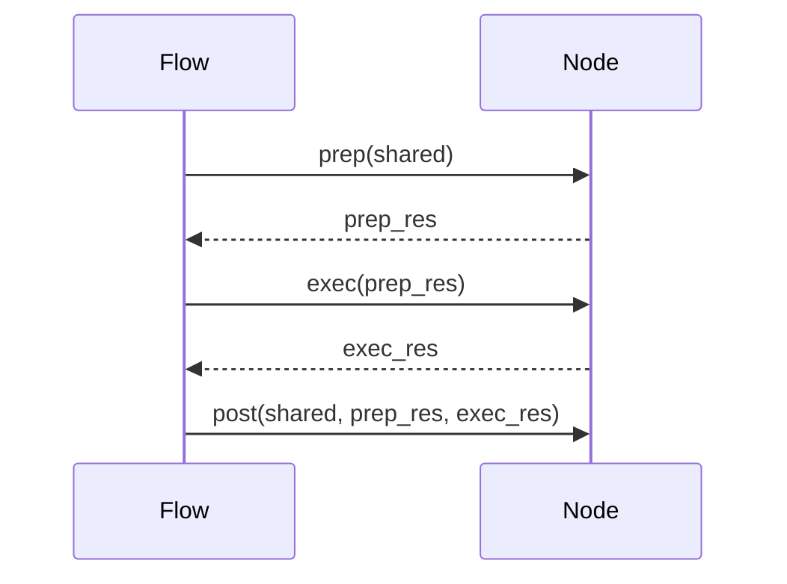

# 第6章：节点抽象

在上一章 [LLM 交互工具](/chapters/05_llm_interaction_utility) 中，我们了解了如何使用 LLM 帮助我们理解和分析代码。现在，让我们深入了解我们如何构建代码来执行教程生成过程中的不同任务。这就是**节点抽象**发挥作用的地方。

想象一下，你正在建造一个可以组装玩具汽车的机器人。你不会希望机器人一次做*所有事情*，对吧？相反，你会将任务分解为更小、更可管理的步骤：

1. 拿起一个轮子。
2. 将轮子安装到车轴上。
3. 对其他轮子重复上述步骤。
4. 将车身安装到底盘上。

这些步骤中的每一个都像一个节点。节点代表 PocketFlow 管道中的单个处理单元。它是我们流水线中的一个工人，负责特定任务。

**为什么我们需要节点抽象？**

节点抽象帮助我们：

* **分解复杂任务：** 它允许我们将教程生成过程分解为更小、更可管理的部分。
* **改善代码组织：** 它使我们的代码更加模块化，更容易理解。
* **实现重用性：** 我们可以在不同的流程或项目中重用节点。
* **简化测试：** 我们可以独立测试每个节点。

**核心概念**

节点抽象的关键概念是：

1. **节点：** 基本构建块。它封装了一个特定的任务。
2. **输入：** 节点接收以执行其任务的数据。
3. **操作：** 节点对输入执行的处理。
4. **输出：** 节点操作的结果。
5. **`prep()` 方法：** 在主处理之前准备输入数据。这是你可以从 `shared` 字典获取数据并进行一些初始转换的地方。
6. **`exec()` 方法：** 这是节点执行其核心操作的地方。它接收 `prep()` 方法的输出作为输入，并返回其处理的结果。
7. **`post()` 方法：** 在 `exec()` 方法之后执行任何必要的后处理步骤。这是你可以将节点的输出存储在 `shared` 字典中供其他节点使用的地方。
8. **`BatchNode`：** 一种特殊类型的节点，一次处理多个项目。把它想象成一个可以处理大量任务的工人团队。

**一个简单示例**

让我们创建一个将文本转换为大写的简单节点：

```python
from pocketflow import Node

class UppercaseNode(Node):
    def prep(self, shared):
        text = shared.get("text", "") # 从共享字典获取文本
        return text # 将文本传递给exec方法

    def exec(self, text):
        # 将文本转换为大写
        uppercase_text = text.upper()
        return uppercase_text

    def post(self, shared, prep_res, exec_res):
        shared["uppercase_text"] = exec_res # 将结果存储在共享字典中
```

**解释：**

* `from pocketflow import Node`：这行从 `pocketflow` 库导入 `Node` 类。
* `class UppercaseNode(Node):`：这定义了一个名为 `UppercaseNode` 的类，它继承自 `Node` 类。
* `def prep(self, shared):`：`prep` 方法从 `shared` 字典获取输入文本。如果 "text" 键不存在，它默认为空字符串。然后它返回文本，这将作为输入传递给 `exec` 方法。
* `def exec(self, text):`：`exec` 方法接收输入文本并使用 `upper()` 方法将其转换为大写。
* `def post(self, shared, prep_res, exec_res):`：`post` 方法将大写文本存储在 `shared` 字典中，键为 "uppercase_text"。

**使用节点**

以下是我们如何在流程中使用 `UppercaseNode`：

```python
from pocketflow import Flow
from pocketflow import Node # 导入Node类
# （包含上面的UppercaseNode定义）

# 实例化节点
uppercase_node = UppercaseNode()

# 创建流程
flow = Flow(start=uppercase_node)

# 准备共享数据
shared_data = {"text": "hello, world!"}

# 运行流程
flow.run(shared_data)

# 打印结果
print(shared_data["uppercase_text"])  # 输出: HELLO, WORLD!
```

**解释：**

* 我们实例化 `UppercaseNode`。
* 我们创建一个以 `UppercaseNode` 为起点的 `Flow`。
* 我们创建一个包含输入文本的 `shared_data` 字典。
* 我们运行流程，传入 `shared_data`。
* `UppercaseNode` 处理文本并将大写版本存储在 `shared_data` 中。
* 最后，我们从 `shared_data` 中打印大写文本。

**节点生命周期**

以下是说明节点生命周期的序列图：



**解释：**

1. `Flow` 调用 `Node` 的 `prep()` 方法，传入 `shared` 字典。
2. `Node` 执行任何必要的准备工作，并将 `prep_res`（准备结果）返回给 `Flow`。
3. `Flow` 调用 `Node` 的 `exec()` 方法，传入 `prep_res`。
4. `Node` 执行其核心操作，并将 `exec_res`（执行结果）返回给 `Flow`。
5. `Flow` 调用 `Node` 的 `post()` 方法，传入 `shared` 字典、`prep_res` 和 `exec_res`。

**`BatchNode`：处理多个项目**

有时，你需要一次处理多个项目。这就是 `BatchNode` 的用武之地。假设你有一个句子列表，你想将每个句子翻译成西班牙语。`BatchNode` 非常适合这种情况。

以下是一个例子：

```python
from pocketflow import BatchNode

class TranslateSentences(BatchNode):
    def prep(self, shared):
        sentences = shared.get("sentences", [])
        return sentences # 准备句子列表

    def exec(self, sentence):
        # 模拟翻译
        translated_sentence = f"已翻译: {sentence}"
        return translated_sentence

    def post(self, shared, prep_res, exec_res_list):
        shared["translated_sentences"] = exec_res_list
```

**解释：**

* `from pocketflow import BatchNode`：这导入 `BatchNode` 类。
* `prep` 方法准备要翻译的句子列表。
* `exec` 方法翻译一个*单个*句子。注意，`exec` 只接受一个句子作为输入，而不是列表。
* `post` 方法将翻译后的句子列表存储在 `shared` 字典中。

**`BatchNode` 如何工作**

`BatchNode` 自动遍历 `prep()` 返回的列表，并对每个项目调用 `exec()`。结果被收集到一个列表中，然后传递给 `post()`。

**我们教程生成项目中的节点**

让我们看一下我们在教程生成项目中使用的一些节点（来自 `nodes.py`）：

* **`FetchRepo`：** 从 GitHub 仓库获取文件。我们在 [GitHub 文件爬虫](/chapters/04_github_file_crawler) 中看到了这一点。
* **`IdentifyAbstractions`：** 使用 LLM 识别代码库中的关键抽象。
* **`AnalyzeRelationships`：** 使用 LLM 分析已识别抽象之间的关系。
* **`OrderChapters`：** 使用 LLM 确定在教程中解释抽象的最佳顺序。
* **`WriteChapters`：** 使用 LLM 为每个抽象写单独的章节。这是一个 `BatchNode`，因为它生成多个章节。
* **`CombineTutorial`：** 将各个章节合并成一个完整的教程。

**示例：`FetchRepo` 节点**

让我们更详细地看一下 `FetchRepo` 节点：

```python
class FetchRepo(Node):
    def prep(self, shared):
        repo_url = shared["repo_url"]
        project_name = shared.get("project_name")
        if not project_name:
            project_name = repo_url.split('/')[-1].replace('.git', '')
            shared["project_name"] = project_name

        include_patterns = shared.get("include_patterns")
        exclude_patterns = shared.get("exclude_patterns")
        token = shared.get("github_token")
        
        return {
            "repo_url": repo_url,
            "include_patterns": include_patterns,
            "exclude_patterns": exclude_patterns,
            "token": token
        }

    def exec(self, prep_res):
        # 使用 GitHub 文件爬虫获取仓库文件
        from utils.crawl_github_files import crawl_github_files
        
        result = crawl_github_files(
            prep_res["repo_url"],
            include_patterns=prep_res["include_patterns"],
            exclude_patterns=prep_res["exclude_patterns"],
            token=prep_res["token"]
        )
        
        return result

    def post(self, shared, prep_res, exec_res):
        # 将文件和统计信息存储在共享字典中
        shared["files"] = exec_res["files"]
        shared["files_stats"] = exec_res["stats"]
```

**解释：**

* `def prep(self, shared):`：这个方法从 `shared` 字典中获取必要的信息，如 `repo_url`、`project_name`、`include_patterns`、`exclude_patterns` 和 `token`。如果 `project_name` 不存在，它会从 `repo_url` 派生出来。
* `def exec(self, prep_res):`：这个方法使用 GitHub 文件爬虫从仓库获取文件。
* `def post(self, shared, prep_res, exec_res):`：这个方法将文件和统计信息存储在 `shared` 字典中，使其可供流程中的其他节点使用。

**示例：`WriteChapters` 节点**

`WriteChapters` 节点是一个 `BatchNode`，它使用 LLM 为每个抽象概念生成一个章节：

```python
class WriteChapters(BatchNode):
    def __init__(self, max_retries=3, wait=10):
        self.max_retries = max_retries
        self.wait = wait
        
    def prep(self, shared):
        abstractions = shared.get("abstractions", [])
        chapter_order = shared.get("chapter_order", [])
        relationships = shared.get("relationships", {})
        project_name = shared.get("project_name", "Unknown Project")
        files = shared.get("files", {})
        
        # 准备要处理的项目列表
        chapter_data = []
        for i, abstraction_id in enumerate(chapter_order):
            # 找到抽象概念
            abstraction = next((a for a in abstractions if a["id"] == abstraction_id), None)
            if not abstraction:
                continue
                
            # 获取相关文件
            related_files = {}
            for filename, content in files.items():
                if abstraction["name"].lower() in filename.lower():
                    related_files[filename] = content
            
            # 创建章节数据
            chapter_data.append({
                "chapter_number": i + 1,
                "abstraction": abstraction,
                "relationships": relationships.get(abstraction_id, {}),
                "project_name": project_name,
                "related_files": related_files,
                "all_abstractions": abstractions
            })
            
        return chapter_data
        
    def exec(self, chapter_data):
        from utils.call_llm import call_llm
        
        # 构建提示
        prompt = f"""为教程生成第 {chapter_data['chapter_number']} 章。
主题是 {chapter_data['project_name']} 项目中的 {chapter_data['abstraction']['name']} 抽象概念。
这个抽象概念的描述是: {chapter_data['abstraction']['description']}

相关的文件:
"""
        
        # 添加相关文件
        for filename, content in chapter_data["related_files"].items():
            prompt += f"\n文件: {filename}\n```\n{content[:1000]}...\n```\n"
            
        # 添加与其他抽象概念的关系
        if chapter_data["relationships"]:
            prompt += "\n这个抽象概念与其他抽象概念的关系:\n"
            for rel_id, rel_type in chapter_data["relationships"].items():
                rel_abstraction = next((a for a in chapter_data["all_abstractions"] if a["id"] == rel_id), None)
                if rel_abstraction:
                    prompt += f"- 与 {rel_abstraction['name']} 的关系: {rel_type}\n"
                    
        prompt += """
请生成一个完整的教程章节，包括:
1. 章节标题
2. 对这个抽象概念的清晰解释
3. 这个抽象概念的代码示例和讲解
4. 如何使用这个抽象概念的实际例子
5. 与其他抽象概念的关系解释

使用 Markdown 格式。
"""
        
        # 调用 LLM 生成章节
        chapter_content = call_llm(prompt)
        
        return {
            "chapter_number": chapter_data["chapter_number"],
            "abstraction_id": chapter_data["abstraction"]["id"],
            "abstraction_name": chapter_data["abstraction"]["name"],
            "content": chapter_content
        }
        
    def post(self, shared, prep_res, exec_res_list):
        # 将章节存储在共享字典中
        shared["chapters"] = sorted(exec_res_list, key=lambda x: x["chapter_number"])
```

**解释：**

* `def prep(self, shared):`：这个方法准备要生成章节的数据列表。对于每个抽象概念，它收集必要的信息，如章节编号、抽象概念详情和相关文件。
* `def exec(self, chapter_data):`：这个方法为一个抽象概念生成一个章节。它构建一个提示，描述抽象概念和相关文件，然后使用 LLM 生成章节内容。
* `def post(self, shared, prep_res, exec_res_list):`：这个方法将生成的章节（按章节编号排序）存储在 `shared` 字典中。

**总结**

节点抽象是我们教程生成项目的基础。它允许我们将复杂的教程生成过程分解为更小、更可管理的部分。通过使用 `Node` 和 `BatchNode` 类，我们可以创建一个模块化、灵活且易于维护的系统。

现在你已经了解了我们教程生成项目的所有主要组件！通过组合 PocketFlow 框架、GitHub 文件爬虫、LLM 交互工具和节点抽象，我们创建了一个强大的系统，可以自动从 GitHub 仓库生成全面的教程。

---

由 [AI 代码库知识构建器](https://github.com/The-Pocket/Tutorial-Codebase-Knowledge) 生成 