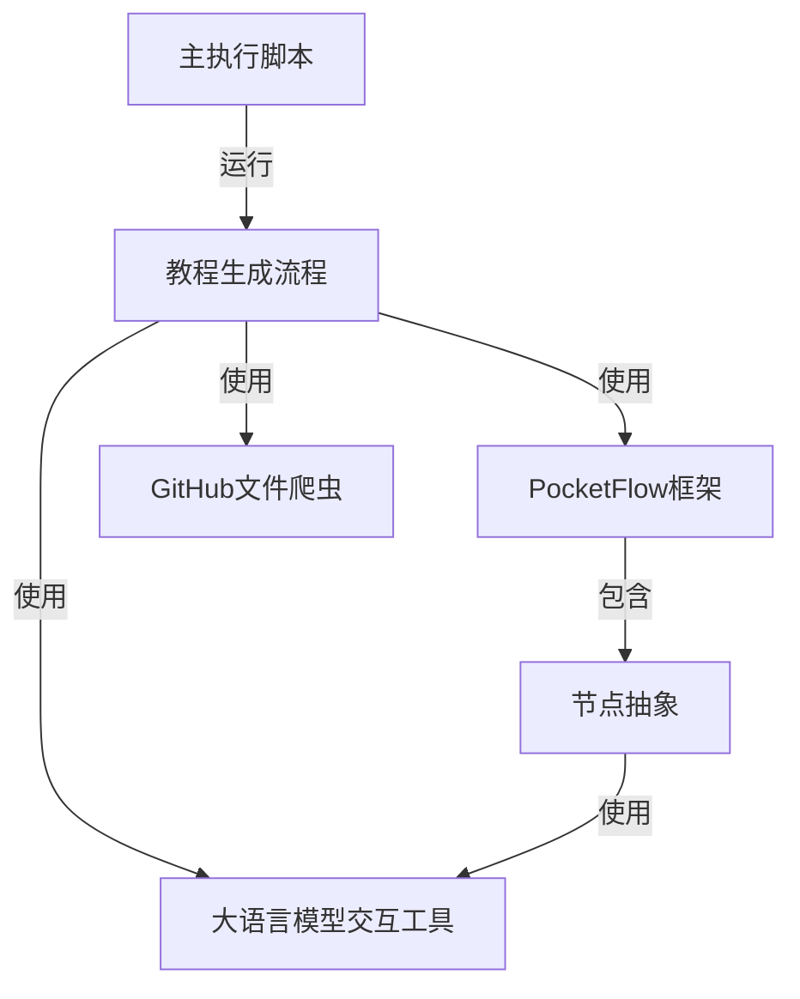

本项目 **代码库知识构建器** 旨在自动为代码库生成教程。它利用大语言模型(LLMs)来理解代码、识别关键抽象，并创建结构化教程。*PocketFlow* 框架协调整个过程，从GitHub获取代码，分析抽象之间的关系，以及生成对初学者友好的章节。

**源代码仓库：** [https://github.com/The-Pocket/Tutorial-Codebase-Knowledge](https://github.com/The-Pocket/Tutorial-Codebase-Knowledge)

## 章节

1. [主执行脚本](01_main_script.mdx)
2. [教程生成流程](02_tutorial_flow.mdx)
3. [PocketFlow框架](03_pocket_flow.mdx)
4. [GitHub文件爬虫](04_github_crawler.mdx)
5. [大语言模型交互工具](05_llm_tools.mdx)
6. [节点抽象](06_node_abstraction.mdx)

---

由[AI Codebase Knowledge Builder](https://github.com/The-Pocket/Tutorial-Codebase-Knowledge)生成 