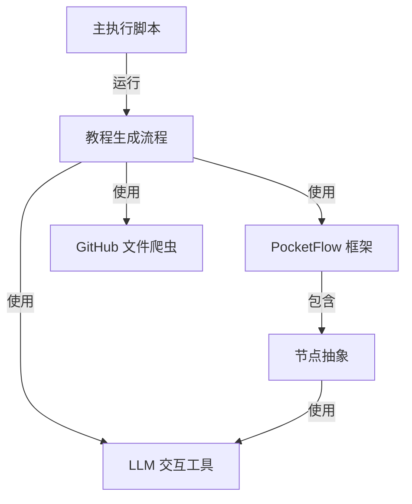

# 教程：代码库知识生成器

本项目 **代码库知识生成器** 旨在自动为代码库生成教程。它利用大型语言模型(LLMs)来理解代码、识别关键抽象概念，并创建结构化教程。*PocketFlow* 框架协调整个过程，从GitHub获取代码，分析抽象概念之间的关系，并生成适合初学者的章节。

**源代码库：** [https://github.com/The-Pocket/Tutorial-Codebase-Knowledge](https://github.com/The-Pocket/Tutorial-Codebase-Knowledge)

## 章节

1. [主执行脚本](/chapters/01_main_execution_script)
2. [教程生成流程](/chapters/02_tutorial_generation_flow)
3. [PocketFlow 框架](/chapters/03_pocketflow_framework)
4. [GitHub 文件爬虫](/chapters/04_github_file_crawler)
5. [LLM 交互工具](/chapters/05_llm_interaction_utility)
6. [节点抽象](/chapters/06_node_abstraction)

---

由 [AI 代码库知识构建器](https://github.com/The-Pocket/Tutorial-Codebase-Knowledge) 生成 